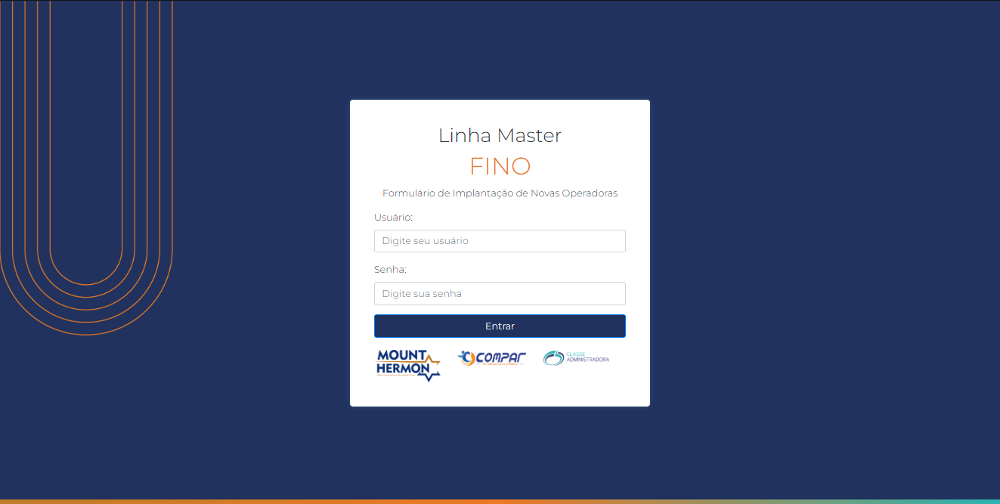

<h1 align="center"> FINO - Formulário de Implantação de Novas Operadoras </h1>

Uso exclusivo e restrito a empresa Linha Master  

  <a href="#-tecnologias">Tecnologias</a>&nbsp;&nbsp;&nbsp;|&nbsp;&nbsp;&nbsp;
  <a href="#-projeto">Projeto</a>&nbsp;&nbsp;&nbsp;|&nbsp;&nbsp;&nbsp;
  <a href="#memo-licença">Licença</a>&nbsp;&nbsp;&nbsp;|&nbsp;&nbsp;&nbsp;

  

 

  

## 🚀 Tecnologias

Esse projeto foi desenvolvido com as seguintes tecnologias:

- Node.JS
- HTML e CSS
- Bootstrap
- JavaScript
- Banco de dados MySQL

## 💻 Projeto

O FINO é um sistema web para a implementação de novas operadoras de Planos de Saúde as administradoras que fazem parte do grupo, com o cadastro de operadora, produtos, entidades de classe, tabelas de preços, calculos de margem, 
e tudo relacionado a implementação de uma nova operadora;

O sistema conta com o relacionamento entre todos esses dados para gerar um preview com todas as informações pertinentes sobre uma nova implantação de operadora para todas as áreas do grupo como financeiro, marketing, comercial e demais áreas interessadas.

Conta também com atualização de status, mostrando o que foi alterado, quando foi e por qual usuário.

## 📝 Licença

USO COM RESTRIÇÕES!

Esse projeto é de propriedade exclusiva da Linha Master.
Entretando o uso da lógica e funcionalidade desde que não utilize a identidade visual é livre.

---

## 🤝 TIME

Feito por [Pablo Petelak - Backend 👽](https://pablopetelak.com) enquanto DEV da [Mídia Ideal](https://midiaideal.com.br) 

E [Maria Almeida - Front 🐀](https://github.com/mariak-fla) enquanto DEV da [Mídia Ideal](https://midiaideal.com.br)

